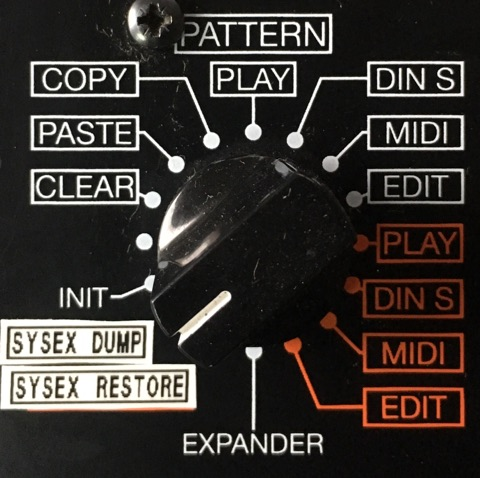

= E-licktronic Yocto V1 manual

:sectnums:

== Description

=== Features
- 11 drums 100% analog cloned *the TR-808*
- A common Accent for all drums
- 16 banks of 16 patterns from 1 to 32 steps
- 16 songs of 256 patterns
- A mono Master OUT
- 11 voice OUTs - one for each drum (using these outputs mutes the relevant voice from the master output)
- 2 Trig Outputs (5V S-trig \~1ms) that allow you to trigger an external instrument (an optional third Trig OUT is present on the IO Board)
- MIDI IN, OUT, THRU (hardware MIDI THRU)
- Din sync24 IN/OUT to synchronize other machines
- Software Update via SysEx

[[Pattern]]
== Pattern

=== Pattern Mode
First choose the pattern you want to play with *STEP BUTTONS*. If you want to change pattern bank, hold *SHIFT* and choose an other pattern bank. When you are holding *SHIFT*, mute, roll and scale leds are switched on indicating you are choosing a bank number.
Press *START* to listen select pattern.

Press *MUTE*. Mute led is blinking. Press one of the 16 steps buttons (1 is the accent, 2 the bassdrum, 3 the snaredrum...) to mute them. Press again to unmute. You can solo instruments by holding *MUTE* and pressing the appropriate step button at the same time. *PUSH ENCODER* unmute and unsolo all instruments.
Press *SHIFT* to exit mute / solo mode.

Press *ROLL*. Roll led is blinking. Press one of the 12 first steps buttons (1 is the accent, 2 the bassdrum, 3 the snaredrum...) to roll them. Release and roll stop. You can change roll scale with the rotary encoder.
Press *SHIFT* to exit.

You can tap in the tempo via the *PUSH ENCODER* when you are in play mode.

You can choose more than one pattern to play. Hold the first pattern and press a second one. Now all patterns are read one after the other.

You can switch between Play Mode and Edit Mode when sequencer is running.

=== Pattern Din Sync
Same as *"Pattern Mode"* but with the sync slaved to external Sync24. In this mode Yocto is waiting for a DIN clock signal.

=== Pattern MIDI Sync
Same as *"Pattern Mode"* but with the sync slaved to external MIDI Sync. In this mode Yocto is waiting for a MIDI clock signal.

=== Pattern Edit

First select bank (*SHIFT*) and the pattern you want to edit.
Press *START*. Select an instrument with *INST SELECTOR*

==== Step Programming
On the 16 step switches, toggle steps that you want to trigger for the current instrument.

==== Tap Programming
Like the original TR-808, it is also possible to use tap entry for patterns. To do this, press the *SHIFT* button at appropriate places in the measure.

==== Clearing steps
- When sequencer is running you can clear individual steps by switching them off on the 16 steps buttons.
- When you want to clear the current playing step of the selected instrument use *PUSH ENCODER*.
- When you want to clear all all steps of the selected instrument, use *SHIFT + PUSH ENCODER*

==== Pattern scale
Press *SCALE* to change scale. (1/32, 1/16, 1/16t or 1/8).

==== Pattern length
Use the buttons *01-16* or *17-32* and press one of the 16 step buttons for the desired length.
If pattern is more than 16 steps, first part and second part switch automatically. If you want to switch them manually push *1-16 BUTTON* and *17-32 BUTTON together*.

== Track

=== Track Play
Choose one of the 16 tracks with *INST SELECTOR*.
Press *START* you listen to current selected track.
When sequencer is not running push *RESET* to return to the beginning of the track.
Four scale leds show you track position in binary. (no led > position 1, first led on > position 2, second led on > position 3, first and second led on > position 4 ...).

=== Track Din Sync
Same as *"Track Play"* but with the sync slaved to external Sync24. In this mode Yocto is waiting for a DIN clock signal.

=== Track MIDI Sync
Same as *"Track Play"* but with the sync slaved to external MIDI Sync. In this mode Yocto is waiting for a MIDI clock signal.

=== Track Edit
First select one of the 16 tracks with *INST SELECTOR*.
Press *RESET* to return to the beginning of the track.
Select the first pattern you want. You can change bank by pressing *SHIFT*. Then press *NEXT*. Now select second pattern of the track.

Press *NEXT*. Four scale leds show you track position in binary. (no led > position 1, first led on > position 2, second led on > position 3, first and second led on > position 4 ...).
If you select the last pattern of the track, press *NEXT* then *END* to mark the end of the track.

== Utility

=== Copy Pattern
Select pattern you want to copy in the buffer. Press *START*. Steps leds scroll.

=== Paste Pattern
Select pattern you want to paste the buffer. Press *START*. Steps
leds scroll.

=== Clear Pattern
Select pattern you want to clear. Press *START*. Steps leds scroll.

=== Init EEPROM
Hold *START and SHIFT*. When you initialise EEPROM, factory presets are copied in Bank 01 and all others patterns are cleared with 16 steps and 1/16 scale, tracks are cleared, and default MIDI Note Numbers are restored for the Expander mode.

=== MIDI Dump

This mode allows you to make a backup of all pattern data by dumping it as MIDI SysEx. This was not part of the original Yocto feature set, so it is not indicated on the front panel. You can find MIDI Dump mode on the empty rotary *switch position 10*, right under INIT.
To dump the complete pattern memory of the Yocto, start your external MIDI recorder, then press *START*. An animation will indicate going over 16 patterns per 16 banks. Another animation will be shown when done.

=== MIDI Restore
This mode allows you to restore previously backed up pattern data to the Yocto's internal memory. As this was not part of the original Yocto feature set, it is not indicated on the front panel. You can find MIDI Restore mode on the empty rotary *switch position 9*, under MIDI Dump, left of Expander.
In this mode, the Yocto is always ready to receive patterns in SysEx format. As soon as you start sending the external data, LED animations will show which pattern/bank are being received.

== Expander
Select Input MIDI channel with steps buttons. To assign MIDI note, select an instrument with *INST SELECTOR*, hold *SHIFT* and send the MIDI note you want to trig the current select instrument (Midi note are hold in the EEprom). Mute led indicate MIDI activity. The default notes are given in the table below:

[options="header"]
|=======================
|INSTRUMENT|MIDI Note Name  |MIDI Note Number
|BD        |C2              |36
|SD   	   |D2              |38
|LT        |F2              |41
|MT        |G2              |43
|HT        |B2              |47
|RS        |C#2             |37
|CP        |D#2             |39
|CB        |G#3             |56
|CY        |C#3             |49
|OH        |A#2             |46
|CH        |F#2             |42
|TR1       |C4              |60
|TR2       |D4              |62
|=======================

Sending a MIDI note with velocity greater than or equal to 100 will trigger the accent for that specific note, not globally.

== SysEx Sofware Update
To update Yocto software, turn off Yocto then turn on while holding step button 1, 3, 5. All steps leds will blink two times.
Yocto are now waiting for Sysex. We recommended MIDI-OX as Sysex loader. (http://www.midiox.com//[www.midiox.com^])

To know your Yocto software version, select Init EEP mode and press *RESET*, you will hear two kick that indicate you are in version 2.0
